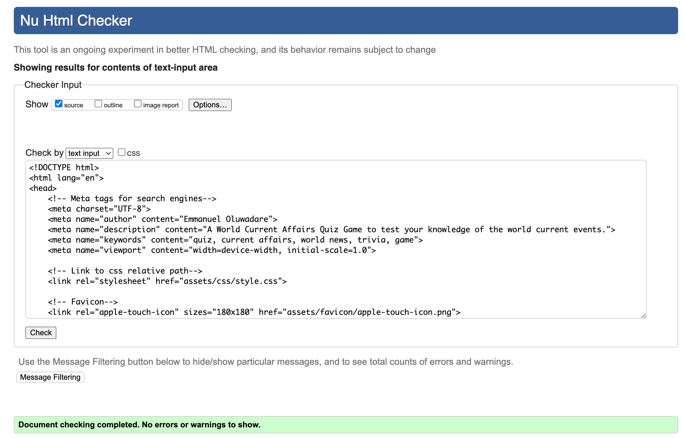

# World Affairs Quiz Game!

<strong>World Affairs Quiz game</strong> is where curiosity meets global awareness! Users embark on a thrilling journey through current trivia events, geopolitical puzzles, and cultural trivia. Whether they are news enthusiasts, students of the world, or simply eager to challenge their understanding of global dynamics, this interactive quiz game offers them a seamless blend of education and entertainment. 

[World Affairs Quiz Game!](https://emmy-dare274.github.io/World-Affairs/) click the link to play quiz.

## <strong>User Stories</strong>

### First Time Visitor Goals:
New users can instantly immerse themselves in world trivia without friction. As a new user, the goal is to try my knowledge about the current affairs of the world.

### Returning Visitor Goals:
Frequent users will experience a dynamic question bank that reshuffles to keep every quiz session unique and engaging. As a frequent user, the aim is to see how I can navigate through the quiz and get more engaging questions each time I try again.

## Features

### Home Page
The home page comprises of a header, the Quiz page that comprises of two dinstinct buttons Play Quiz and Instruction button, and a Footer that links to 5 social media platforms.

## Quiz Screen

### Footer

### Future ideas
Given the constraints of an imminent deadline, further enhancements to the Quiz Game could not be implemented within the available timeframe. With additional development time, the following features would have significantly elevated user engagement and competitive appeal:

  - Create a reward section for the quiz game where user gets a reward for answering all questions correctly.

## Design and Color Scheme

### Typography

## Technologies Used

### Languages

- [HTML](https://developer.mozilla.org/en-US/docs/Web/HTML) used for body structure
- [CSS](https://developer.mozilla.org/en-US/docs/Web/css) used for styling.
- [Javascript](https://developer.mozilla.org/en-US/docs/Web/JavaScript) user for interaction with the DOM

### Frameworks - Libraries - Programs Used

- [Am I Responsive](https://ui.dev/amiresponsive) - Used for responsiveness of website on various screens.
- [Chrome Dev Tools](https://developer.chrome.com/docs/devtools/) - Used for debugging and development of the app.
- [Font Awesome](https://fontawesome.com/) - Used for social media icons.
- [Google Fonts](https://fonts.google.com/) - Used to import Fonts.
- [W3C](https://www.w3.org/) - Used for HTML & CSS Validation.
- [JSHINT](https://jshint.com/) - used to validate javascript code.
- [Coolors](https://coolors.co/) - Used to create colour palette.
- [Favicon](https://favicon.io/) - Used to create the favicon.
- [VSCode](https://code.visualstudio.com/) was used to write and edit the code.
- [Git](https://git-scm.com/) - was used for the version control.
- [GitHub](https://github.com/) - for storing the code.
- [GitHub Pages](https://pages.github.com/) - for live view of the website.

## Testing

## Validator testing
### HTML
- No errors or warnings were found when passing through the official W3C validator.

### CSS
- No errors or warnings were found when checked through the official W3C validator.

### Javascript
- No errors or warnings were found when checked through JSHINT.

## Lighthouse report

- lighthouse in devtools was used to check that the website is performing well, accessible and the colors and fonts chosen are readable.

## Deployment

I deployed the project using GitHub pages:

- First clicked settings in my GitHub repository.
- Then clicked 'pages' from the left-hand side of the page.
- I selected Source - Deploy from the branch.
- The main branch was selected and the folder was 'root'.
- Under the branch, I clicked save.
- I then went back to the code tab in the Environments section and clicked on GitHub Pages.
- Then clicked on view deployments to see the live site.

